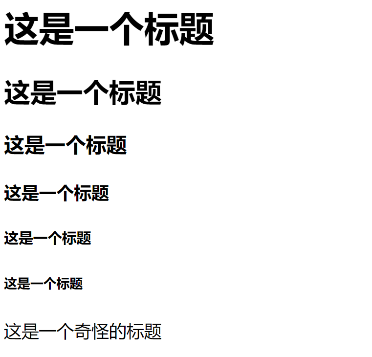

# BriefIntroductionNote

这里对 HTML 四个基本的元素作说明

---

## HTML 标题

一般由以下代码申明 HTML 标题

```html
<h1>这是一个标题</h1>
<h2>这是一个标题</h2>
<h3>这是一个标题</h3>
<h4>这是一个标题</h4>
<h5>这是一个标题</h5>
<h6>这是一个标题</h6>
<h8>这是一个奇怪的标题</h8>
```

具体效果如下：



---

## HTML 段落

```html
<p>这是段落1</p>
<p>这是段落2</p>


<p>
    <h1>这是段落1中的1级标题</h1>
    <h2>这是段落1中的2级标题</h2>
    <h3>这是段落1中的2级标题</h3>
    <h4>这是段落1中的2级标题</h4>
    <h5>这是段落1中的2级标题</h5>
    <h6>这是段落1中的2级标题</h6>
</p>

<p>
    <h1>这是段落2中的1级标题</h1>
    <h2>这是段落2中的2级标题</h2>
</p>
```

类似于标题

---

## HTML 超链接与图片载入

```html
图片

<p>
    <h1>
        
    </h1>
</p>
<!-- 一般网络使用/，本地使用\（windows文件浏览器） -->

链接<a href="网址">链接名</a>
<a href="https://www.61.com">这是一个神秘链接</a>

<p>
    <a href="https://www.61.com">这是一个神秘链接</a>
    <h1>
        <a href="https://www.61.com">这是一个神秘链接</a>
    </h1>
    <h2>
        <a href="https://www.61.com">这是一个神秘链接</a>
    </h2>
</p>
```
